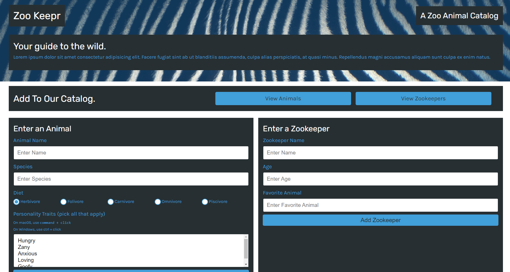

  # Zookeepr
  
  A fullstack application using Express.js and deployed to Heroku that hosts a catalogue of zoo animals and zookeepers. This application allows users to submit new zoo animals and zookeepers using serverside POST requests. Information submitted is validated before being posted to the database.
  
  ## Table of Contents
  
  * [Installation](#installation)
  * [Built With](#built)
  * [Usage Information](#usage)
  * [Authors & Acknowledgements](#credits)
  * [Tests](#tests)
  * [Contact](#questions)
  
  ## Installation 
  This application can be accessed online, and animal/zookeeper entry submissions are handled via the built-in form fields.

  ## Built With 
  * HTML
  * CSS
  * JavaScript
  * Jest
  * Express.js
  * Node.js
  * NPM
  
  ## Usage Information
  [Zookeepr]("https://pacific-crag-48954.herokuapp.com/") 
    
  This application was made specifically for the animals and staff at Zookeepr. 
    
    
  ## Authors & Acknowledgements
  
  © 2020 - 2022 Trilogy Education Services, a 2U, Inc. brand. All Rights Reserved.
  
  Made by [TOVTC](https://github.com/TOVTC).
  
  ## Tests
    Tests were written and conducted via Jest to validate object creation and method functionality for both animal and zookeeper entries.
    
  ## Questions?
  Contact repository author via [GitHub](https://github.com/TOVTC). 